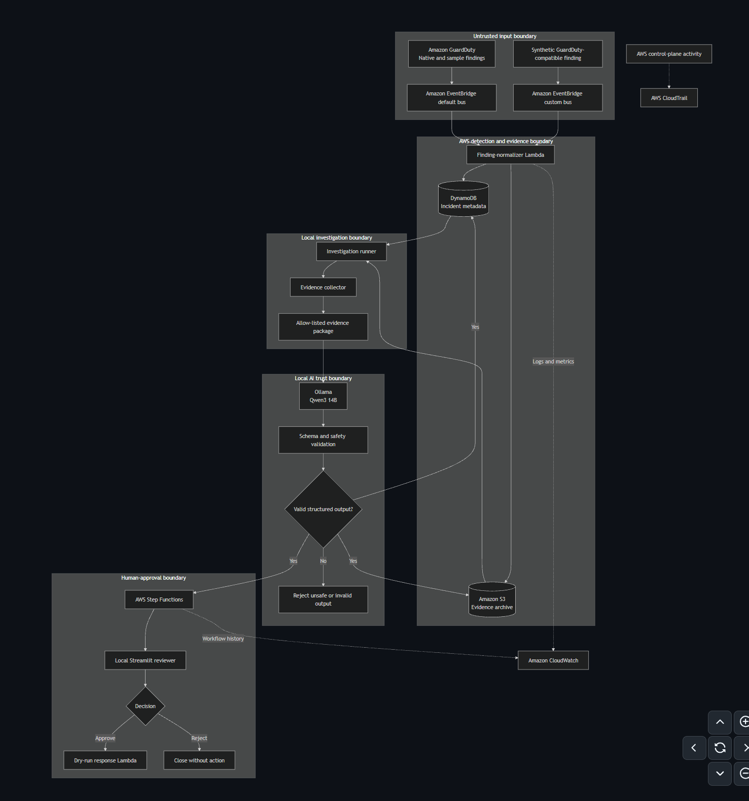
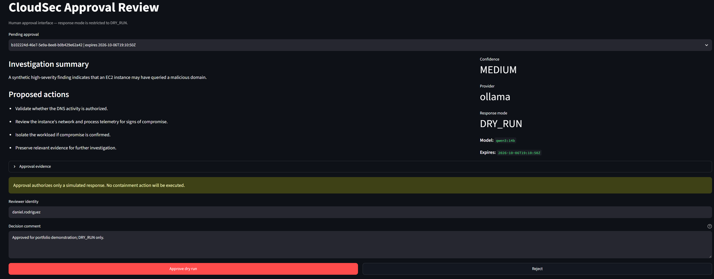
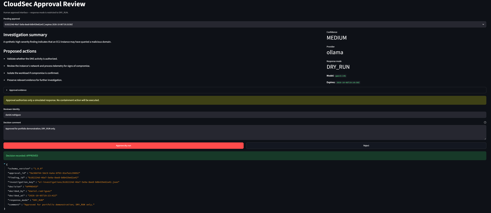
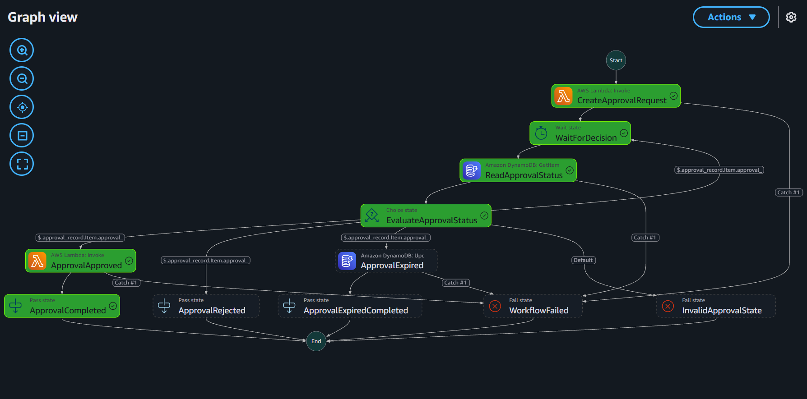
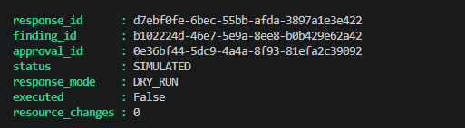

# AI CloudSec Incident Responder Lab

An end-to-end cloud security portfolio project that ingests Amazon GuardDuty findings, investigates allow-listed evidence with a local AI model, requires explicit human approval, and records only non-destructive dry-run responses.

**Status:** Portfolio ready. The complete workflow has been implemented and validated across `APPROVED`, `REJECTED`, and `EXPIRED` outcomes.

## What this project demonstrates

- Event-driven security finding ingestion and normalization on AWS.
- Encrypted evidence preservation in Amazon S3 and incident tracking in DynamoDB.
- Evidence minimization before local analysis with Ollama and Qwen3 14B.
- Versioned JSON schemas and safety validation for untrusted AI output.
- Human review through Streamlit and orchestration with AWS Step Functions.
- Auditable dry-run response execution with zero infrastructure changes.
- Least-privilege IAM, Terraform-managed infrastructure, logging, and cost controls.

## Technology stack

| Area | Technologies |
|---|---|
| Detection and ingestion | Amazon GuardDuty, Amazon EventBridge |
| Processing | AWS Lambda, Python |
| Evidence and metadata | Amazon S3, Amazon DynamoDB |
| AI investigation | Ollama, Qwen3 14B, JSON Schema |
| Human approval | Streamlit, AWS Step Functions |
| Infrastructure | Terraform |
| Audit and cost controls | Amazon CloudWatch, AWS CloudTrail, AWS Budgets |

## Implemented workflow

GuardDuty finding → EventBridge → finding-normalizer Lambda → Amazon S3 and DynamoDB → local Ollama investigation → schema validation → Streamlit reviewer and AWS Step Functions → dry-run response Lambda → audit trail

## Demonstration evidence

### Architecture overview



### Human approval

The reviewer receives the validated investigation, proposed actions, model metadata, and an explicit warning that only a simulated response is authorized.



The decision is recorded with the reviewer identity, comment, timestamp, and `DRY_RUN` response mode.



### Approval orchestration

AWS Step Functions evaluates the stored decision and follows the approved branch to completion.



### Safe response execution

The approved response remains non-destructive: it is recorded as `SIMULATED`, with `executed` set to `false` and zero resource changes.



## Repository structure

- `docs/` — Architecture, setup notes, threat model, and project decisions.
- `infrastructure/` — Infrastructure-as-code definitions.
- `src/` — Python application and Lambda function code.
- `tests/` — Automated tests.
- `sample-events/` — Synthetic security findings with no sensitive data.

## Documentation

- [Project charter](docs/project-charter.md)
- [Environment setup notes](docs/setup-notes.md)
- [Architecture](docs/architecture.md)
- [Approval workflow validation](docs/approval-workflow-validation.md)
- [Security and cost review](docs/security-cost-review.md)
- [Threat model](docs/threat-model.md)
- [Sprint 0 retrospective](docs/sprint-0-retrospective.md)
- [Sprint 1 retrospective](docs/sprint-1-retrospective.md)
- [Terraform state design](docs/terraform-state.md)
- [Terraform deployment role design](docs/terraform-deployment-role.md)
- [EventBridge DLQ design](docs/eventbridge-dlq.md)
- [End-to-end demo walkthrough](docs/demo-walkthrough.md)
- [Portfolio case study](docs/portfolio-case-study.md)


## Local validation

Activate the Python virtual environment and run the project validation script before committing changes:

```powershell
.\scripts\validate_project.ps1
```

The script validates the synthetic fixtures, normalized finding schema, Python unit tests, Terraform formatting and configuration, and Git whitespace.

## Security principles

- Least-privilege access
- No credentials or sensitive data in source control
- Evidence-based AI analysis
- Human approval before response actions
- Logging and auditability
- Cost-aware cloud deployment

## Known limitation

Amazon Bedrock inference quotas remain unavailable for this AWS account. The lab therefore uses local Qwen3 14B through Ollama as its active model provider while retaining the Bedrock adapter for future use. Amazon GuardDuty is enabled in `us-east-1` with cost-controlled foundational protection.

## Roadmap

1. Foundation and threat model
2. AWS security baseline
3. Detection pipeline
4. AI-assisted investigation
5. Human approval and portfolio demonstration
