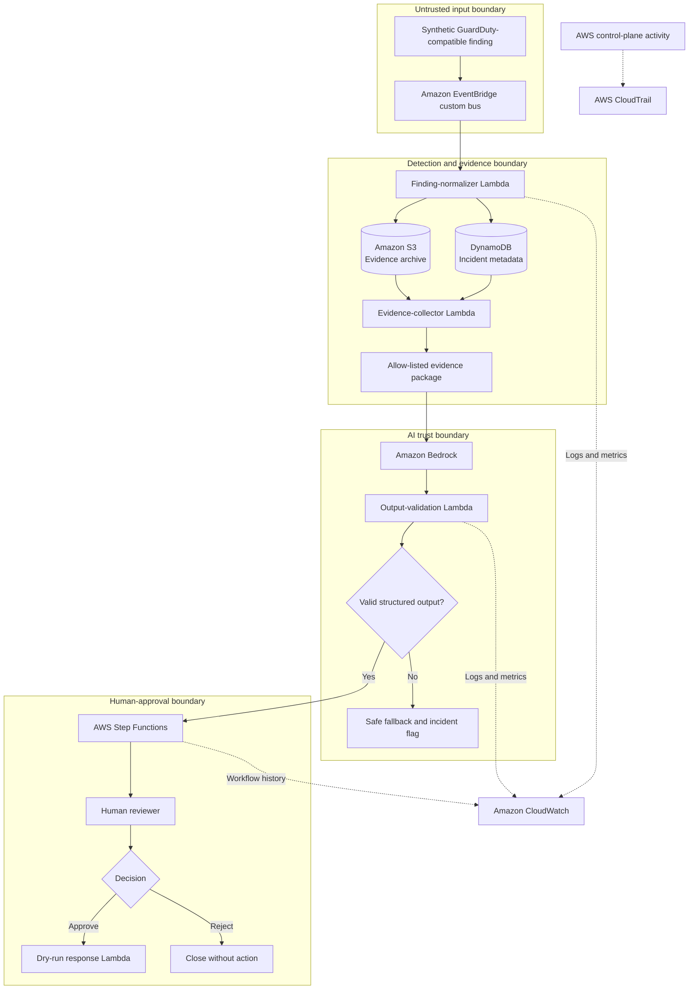

# Architecture

## Status

Planned architecture — not yet deployed.

## Overview

The AI CloudSec Incident Responder uses an event-driven AWS architecture to process synthetic cloud-security findings, preserve evidence, generate an AI-assisted investigation, and require human approval before any simulated response.

## Architecture diagram

## Data flow

| Step | Source | Destination | Data |
|---:|---|---|---|
| 1 | Synthetic fixture | EventBridge | GuardDuty-compatible JSON with no sensitive data |
| 2 | EventBridge | Normalizer Lambda | Original event envelope |
| 3 | Normalizer Lambda | DynamoDB | Incident ID, severity, status, timestamps, and normalized metadata |
| 4 | Normalizer Lambda | S3 | Raw and normalized evidence |
| 5 | DynamoDB and S3 | Evidence collector | Only evidence required for the investigation |
| 6 | Evidence collector | Bedrock | Size-limited and allow-listed evidence package |
| 7 | Bedrock | Output validator | Untrusted structured investigation candidate |
| 8 | Output validator | Step Functions | Validated recommendation or safe failure status |
| 9 | Step Functions | Human reviewer | Evidence summary and proposed response |
| 10 | Human reviewer | Dry-run response | Explicit approval or rejection |
| 11 | Dry-run response | Audit trail | Simulated action result; no real containment |

## Trust boundaries

### Untrusted input boundary

Synthetic findings are treated as untrusted. Schema validation and normalization must occur before their fields are used by downstream components.

### Evidence boundary

S3 and DynamoDB hold the authoritative incident evidence. Access is restricted through service-specific IAM roles, encryption, and public-access controls.

### AI boundary

Amazon Bedrock receives only allow-listed evidence. Model output is treated as untrusted and must pass structural and safety validation.

### Human-approval boundary

No response recommendation can reach the dry-run response function without an explicit human decision recorded by the workflow.

### Audit boundary

CloudWatch captures application logs and metrics. CloudTrail records relevant AWS control-plane activity.

## Security decisions

- Use synthetic findings because GuardDuty is unavailable in the current account.
- Do not place credentials, account identifiers, or sensitive data in event fixtures.
- Preserve raw evidence separately from normalized incident metadata.
- Send only required and size-limited evidence to Bedrock.
- Validate AI output before storing or presenting it as a recommendation.
- Keep evidence collection, AI processing, and response roles separate.
- Require human approval before every simulated response.
- Implement response actions only in dry-run mode.
- Encrypt stored evidence and block public access.
- Review every Terraform plan before deployment.

## Failure behavior

- Invalid input is rejected and logged without invoking Bedrock.
- Missing evidence produces an incomplete-investigation status.
- Invalid AI output is preserved for analysis but cannot proceed to approval.
- Workflow failures retain the incident and evidence for manual review.
- Rejected or timed-out approvals execute no response.
- Repeated failures create alerts without automatically retrying destructive actions.

## Deployment approach

Infrastructure will be introduced incrementally through Terraform. Each change must pass formatting, validation, plan review, security review, and cost review before deployment.