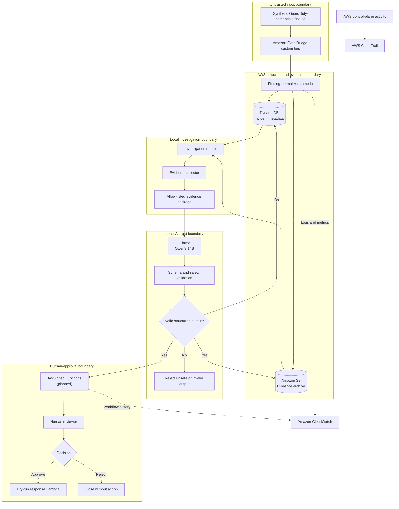

# Architecture

## Status

Planned architecture — not yet deployed.

## Overview

The AI CloudSec Incident Responder uses an event-driven AWS architecture to process synthetic cloud-security findings, preserve evidence, generate an AI-assisted investigation, and require human approval before any simulated response.

## Architecture diagram

```mermaid
flowchart TD
    subgraph Input["Untrusted input boundary"]
        A["Synthetic GuardDuty-compatible finding"]
        B["Amazon EventBridge custom bus"]
        A --> B
    end

    subgraph Processing["AWS detection and evidence boundary"]
        C["Finding-normalizer Lambda"]
        D[("DynamoDB<br/>Incident metadata")]
        E[("Amazon S3<br/>Evidence archive")]

        C --> D
        C --> E
    end

    subgraph Local["Local investigation boundary"]
        F["Investigation runner"]
        G["Evidence collector"]
        H["Allow-listed evidence package"]

        F --> G
        G --> H
    end

    subgraph AI["Local AI trust boundary"]
        I["Ollama<br/>Qwen3 14B"]
        J["Schema and safety validation"]
        K{"Valid structured output?"}
        T["Reject unsafe or invalid output"]

        I --> J
        J --> K
        K -- "No" --> T
    end

    subgraph Approval["Human-approval boundary"]
        L["AWS Step Functions<br/>(planned)"]
        M["Human reviewer"]
        N{"Decision"}
        O["Dry-run response Lambda"]
        P["Close without action"]

        L --> M
        M --> N
        N -- "Approve" --> O
        N -- "Reject" --> P
    end

    B --> C
    D --> F
    E --> F
    H --> I
    K -- "Yes" --> D
    K -- "Yes" --> E
    K -- "Yes" --> L

    C -. "Logs and metrics" .-> Q["Amazon CloudWatch"]
    L -. "Workflow history" .-> Q
    R["AWS control-plane activity"] -.-> S["AWS CloudTrail"]
```

## Data flow

| Step | Source | Destination | Data |
|---:|---|---|---|
| 1 | Synthetic fixture | EventBridge | GuardDuty-compatible JSON with no sensitive data |
| 2 | EventBridge | Normalizer Lambda | Original event envelope |
| 3 | Normalizer Lambda | DynamoDB | Incident ID, severity, status, timestamps, and normalized metadata |
| 4 | Normalizer Lambda | S3 | Raw and normalized evidence |
| 5 | DynamoDB and S3 | Local investigation runner | Existing normalized finding selected for investigation |
| 6 | Local investigation runner | Evidence collector | Normalized finding processed on the trusted workstation |
| 7 | Evidence collector | Local Ollama model | Size-limited and allow-listed evidence package |
| 8 | Local Ollama model | Schema and safety validator | Untrusted structured investigation candidate |
| 9 | Schema and safety validator | S3 and DynamoDB | Validated investigation, provider metadata, and completion status |
| 10 | Schema and safety validator | Step Functions | Approval-ready recommendation; planned integration |
| 11 | Step Functions | Human reviewer | Evidence summary and proposed response |
| 12 | Human reviewer | Dry-run response | Explicit approval or rejection |
| 13 | Dry-run response | Audit trail | Simulated action result; no real containment |

## Trust boundaries

### Untrusted input boundary

Synthetic findings are treated as untrusted. Schema validation and normalization must occur before their fields are used by downstream components.

### Evidence boundary

S3 and DynamoDB hold the authoritative incident evidence. Access is restricted through service-specific IAM roles, encryption, and public-access controls.

### Local investigation boundary

The local runner retrieves an existing normalized finding from AWS, applies the evidence allow-list, invokes the configured model, validates the result, and persists only an approved structured document. AWS credentials remain outside the model process.

### AI boundary

Qwen3 14B currently runs through Ollama on the trusted workstation. The Ollama client accepts only loopback HTTP endpoints, and the model receives only size-limited, allow-listed evidence. Model output is untrusted and must satisfy the versioned JSON schema and safety checks before persistence. Amazon Bedrock remains an optional provider adapter for future use when account quotas become available.

### Human-approval boundary

No response recommendation can reach the dry-run response function without an explicit human decision recorded by the workflow.

### Audit boundary

CloudWatch captures application logs and metrics. CloudTrail records relevant AWS control-plane activity.

## Security decisions

- Use synthetic findings because GuardDuty is unavailable in the current account.
- Do not place credentials, account identifiers, or sensitive data in event fixtures.
- Preserve raw evidence separately from normalized incident metadata.
- Send only required and size-limited evidence to the configured model provider; local Ollama access is restricted to loopback HTTP.
- Validate AI output before storing or presenting it as a recommendation.
- Keep evidence collection, AI processing, and response roles separate.
- Require human approval before every simulated response.
- Implement response actions only in dry-run mode.
- Encrypt stored evidence and block public access.
- Review every Terraform plan before deployment.

## Failure behavior

- Invalid input is rejected and logged without invoking the configured model.
- Missing or oversized evidence stops the investigation before model invocation.
- An unavailable local model leaves the existing AWS incident unchanged and available for retry.
- Invalid or unsafe model output is rejected and cannot be persisted or forwarded for approval.
- Persistence requires an existing DynamoDB incident and explicit human-approval metadata.
- Workflow failures retain the original incident and evidence for manual review.

## Deployment approach

Infrastructure will be introduced incrementally through Terraform. Each change must pass formatting, validation, plan review, security review, and cost review before deployment.